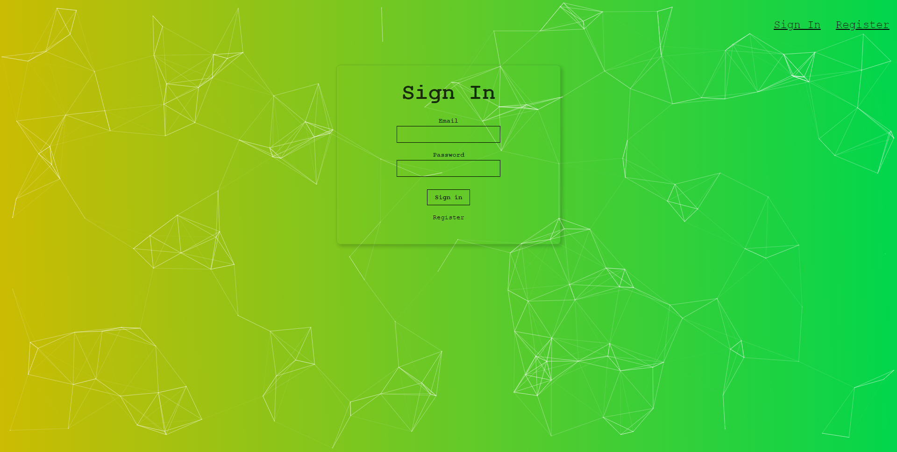
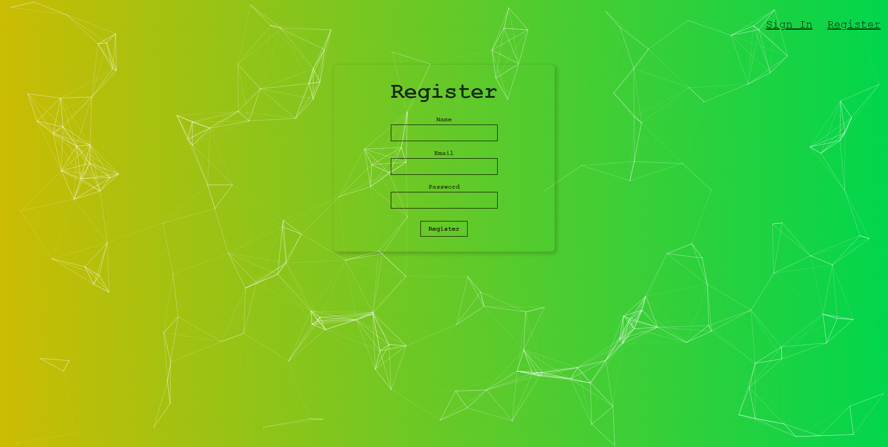
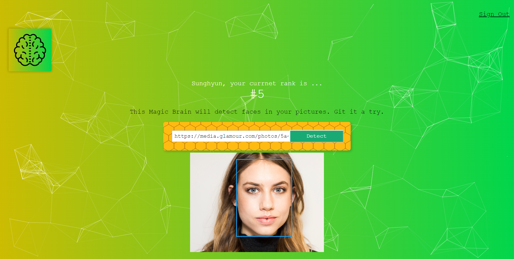

# facerecognitionbrain

## Face recongnition by Clarifai API.

## 소개

얼굴 인식 웹페이지입니다. React 기반으로 제작되었으며, Clarifai API를 이용하여 이미지의 얼굴을 인식합니다.

본 앱은 create-react-app을 통해 React 기반으로 제작되었습니다.

## 사용법

### 로그인 페이지

로그인 이후에 이미지 얼굴 인식 서비스를 이용할 수 있습니다. 로그인은 사용자의 Name과 password를 입력하고, Signin 버튼을 눌러 진행할 수 있습니다. 회원이 아닐 경우, 우측 상단의 내비게이션 바에 있는 Register 링크를 통해 회원가입을 진행할 수 있습니다.

필요한 회원정보를 입력하면 회원가입이 가능합니다. 필요한 회원정보는 다음과 같습니다.
1. Name
2. Email
3. Password

회원가입 성공 후에는 가입한 계정 정보로 즉시 로그인됩니다.

Signin 혹은 Register 버튼을 클릭하여 로그인 또는 회원가입을 완료하면 FaceRecognitionFace App의 홈페이지가 표시됩니다.

1. 사용자가 원하는 이미지의 URL을 입력.
2. Detect 버튼을 눌러 사용자가 입력한 이미지 URL을 전송.
3. 전송된 이미지를 API로 분석하고 결과를 출력합니다.
